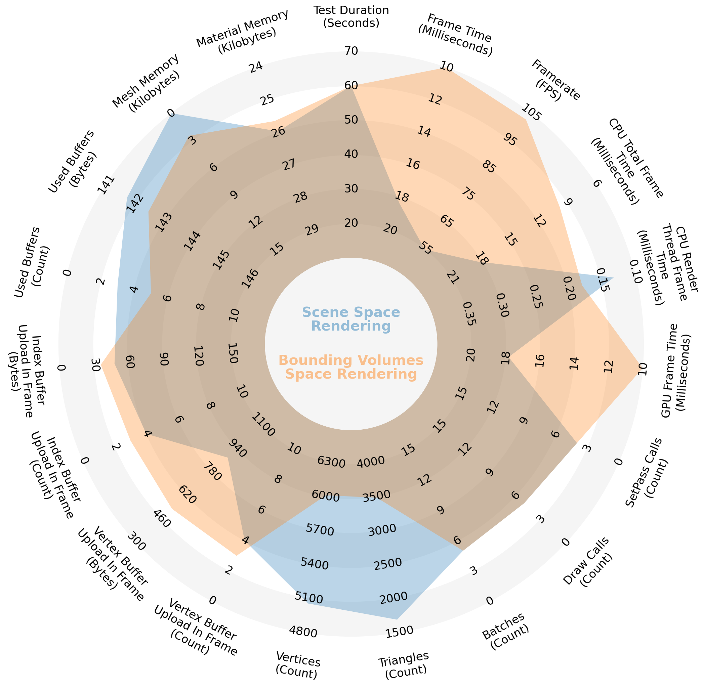

# Performance Metrics Visualization

  The primary goal of this project is to create a visual representation of rendering efficiency metrics, for inctance, gathered in
  Unity using the <a href="https://docs.unity3d.com/Packages/com.unity.test-framework.performance@1.0">Performance Testing Extension</a> package
  for the <a href="https://docs.unity3d.com/Packages/com.unity.test-framework@1.4">Unity Test Runner framework</a>.

## Radar Chart

  To quantify the peformance differences between two approaches and their compare was developed a custom solution using
  the <a href="https://github.com/andrewRowlinson/mplsoccer">mplsoccer Python library</a>, resulting in a visually informative radar chart for comparative analysis.

## Examples

  This tool has been used to compare the peformance metrics of 
  <a href="data/input/unity_tests/scene_space_rendering_vs_bounding_volumes_space_rendering">scene space and bounding volumes space rendering techniques</a> of ray marching.
  The results for <a href="data/input/unity_tests/scene_space_rendering_vs_bounding_volumes_space_rendering/test_scene_1">test scene 1</a>
  can be seen in the rendering performance comparison radar chart in Figure 1.

 

<i>Figure 1.</i> Rendering performance comparison radar chart 
  (average values calculated from data measured during 60 seconds)
